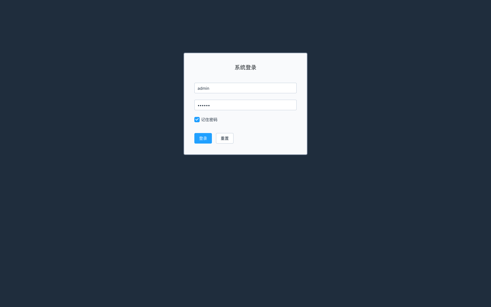
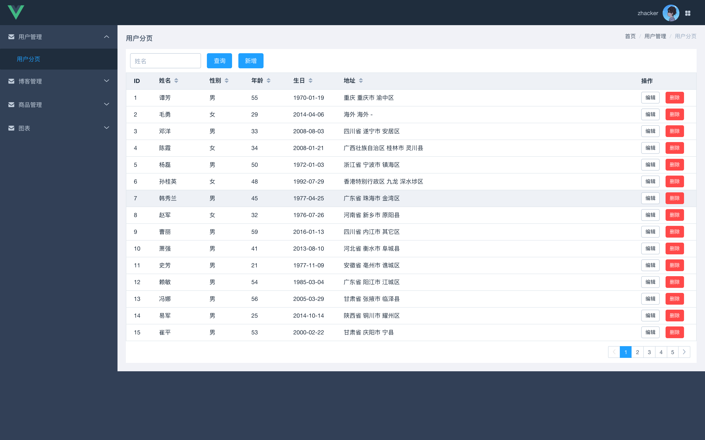
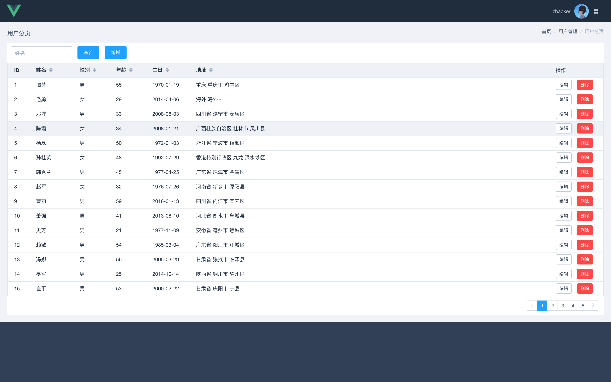
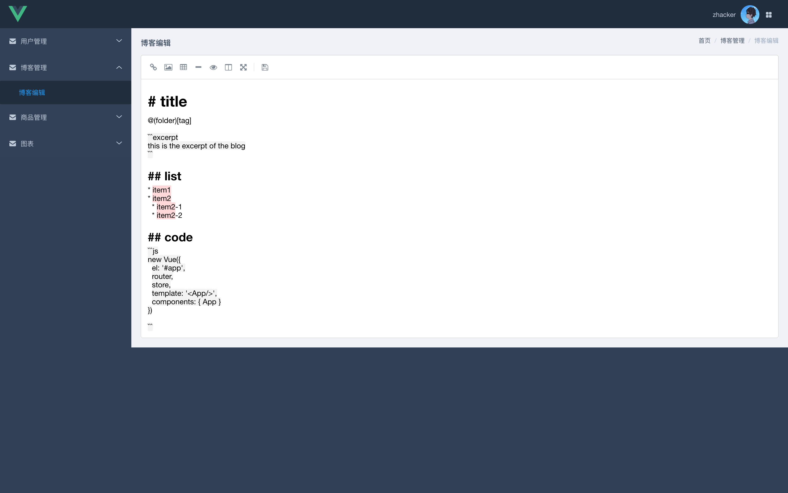
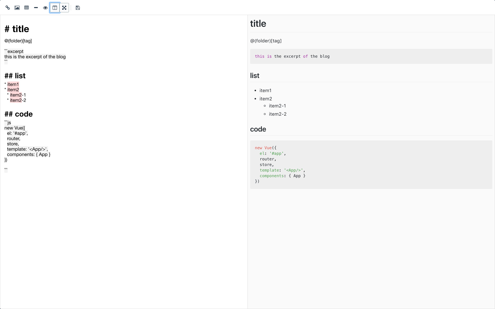
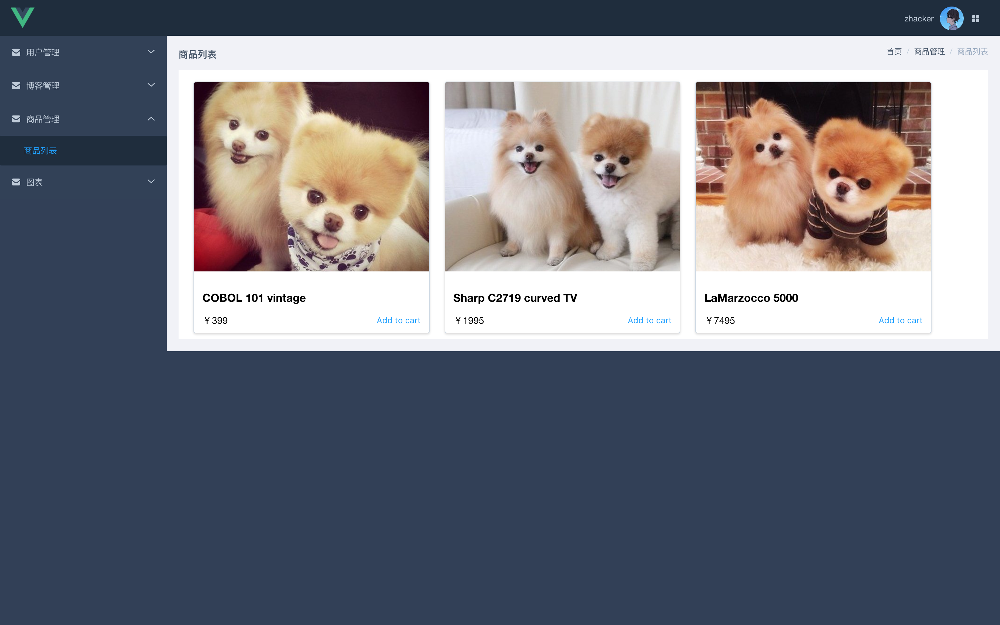
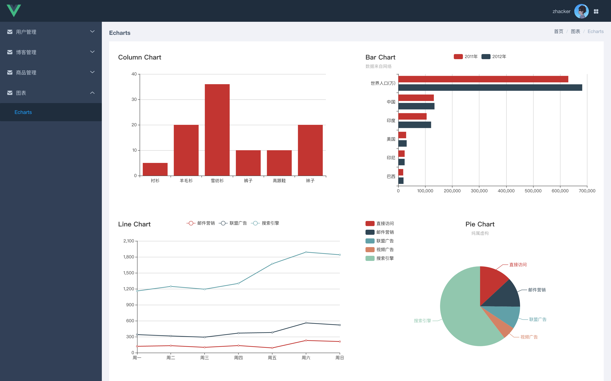

# vue-scope

> vue scope of the front end

## origin
[taylorchen709/vue-admin](https://github.com/taylorchen709/vue-admin)

## Build Setup

``` bash
# install dependencies
npm install

# serve with hot reload at localhost:8080
npm run dev

# build for production with minification
npm run build

# build for production and view the bundle analyzer report
npm run build --report

# run unit tests
npm run unit

# run all tests
npm test
```

For detailed explanation on how things work, checkout the [guide](http://vuejs-templates.github.io/webpack/) and [docs for vue-loader](http://vuejs.github.io/vue-loader).

## demo

登录


用户列表


用户列表（无菜单）


博客编辑（Markdown）


博客编辑全屏（Simplemde Markdown）


商品列表（Card）


Echarts
